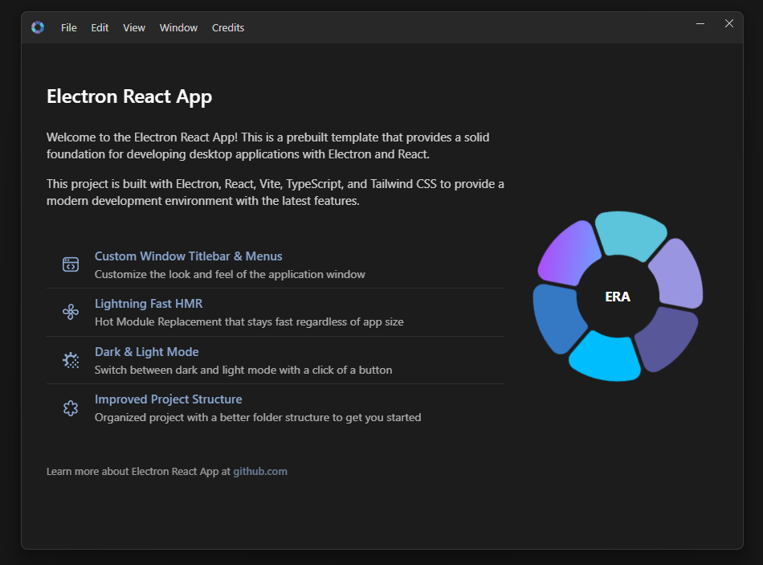

# Electron React App

<br />
<p align="center">
    
</p>

A modern Electron application template with React, Vite, TypeScript, and TailwindCSS. This project provides a solid foundation for developing cross-platform desktop applications.

<br />

 &nbsp;
 &nbsp;
 &nbsp;
 &nbsp;
 &nbsp;


<br />

<p align="center">
    
</p>

<p align="center">
    <a href="https://imgur.com/B5pGkDk">Watch Video Preview</a>
</p>

<br />

## Stack

🔹 [Electron](https://www.electronjs.org/) - Cross-platform desktop application framework.<br />
🔹 [React](https://react.dev/) - Component-based UI library.<br />
🔹 [TypeScript](https://www.typescriptlang.org/) - Type-safe JavaScript.<br />
🔹 [Shadcn UI](https://ui.shadcn.com/) - Beautiful and accessible component library.<br />
🔹 [TailwindCSS](https://tailwindcss.com/) - Utility-first CSS framework.<br />
🔹 [Electron Vite](https://electron-vite.org/) - Lightning-fast build tool based on [Vite](https://vite.dev/) for fastest hot-reload.<br />
🔹 [Electron Builder](https://www.electron.build/index.html) - Configured for packaging applications.<br />

<br />

## In-Built Features

🔹 [Conveyor](lib/conveyor/README.md) - Type-safe inter-process communication with Zod validation.<br />
🔹 Custom Window Titlebar & Menus - Style the window titlebar and menus as you want.<br />
🔹 Clean Project Structure - Separation of main and renderer processes.<br />
🔹 Resources Protocol - Access resources folder via `res://` protocol.<br />
🔹 Import path aliases – Keep your imports organized and clean.<br />
🔹 Theme Switcher - Built-in theme switching for dark and light mode.<br />
🔹 Error Boundary - Built-in React error boundary with detailed error reporting.<br />
🔹 Welcome Kit - Interactive showcase with Framer Motion animations.<br />
🔹 Code Formatting - Prettier and ESLint pre-configured for code quality.<br />
🔹 Hot Reload - Lightning-fast development with Vite's HMR.<br />
🔹 VS Code Debugging - Pre-configured launch configurations for debugging main and renderer processes.<br />

<br />

## Installation

Clone the repository:

```bash
# Clone the repository
git clone https://github.com/guasam/electron-react-app

# Change directory
cd electron-react-app

# Install dependencies (use any package manager: npm, yarn, pnpm, bun)
npm install
```

<br />

## Development

Start the development server:

```bash
npm run dev
```

This will start Electron with hot-reload enabled so you can see changes in real time.

<br />

## Building for Production

Build the application for your platform:

```bash
# For Windows
npm run build:win

# For macOS
npm run build:mac

# For Linux
npm run build:linux

# Unpacked for all platforms
npm run build:unpack
```

Distribution files will be located in the `dist` directory.

<br />

## Conveyor - Inter-Process Communication

This project implements **Conveyor**, a **type-safe IPC (Inter-Process Communication)** system using Zod schemas for runtime validation. Conveyor provides a clean, modular API interface between the renderer and main processes with full TypeScript support.

📖 **For detailed Conveyor documentation and advanced usage instructions, see its [README](lib/conveyor/README.md)**

### Quick Start

```tsx
// In your React component
import { useEffect, useState } from 'react'
import { useConveyor } from '@/app/hooks/use-conveyor'

function AppInfo() {
  const [version, setVersion] = useState<string>('')
  const conveyor = useConveyor()

  useEffect(() => {
    // Get app version from main process
    conveyor.app.version().then(setVersion)
  }, [])

  const handleMinimize = () => {
    conveyor.window.windowMinimize()
  }

  const handleOpenUrl = (url: string) => {
    conveyor.window.webOpenUrl(url)
  }

  return (
    <div>
      <p>App Version: {version}</p>
      <button onClick={handleMinimize}>Minimize</button>
      <button onClick={() => handleOpenUrl('https://github.com')}>Open GitHub</button>
    </div>
  )
}
```

### Available APIs

The IPC system exposes several APIs through:

- global window object `window.conveyor`
- react hook `useConveyor()`

### Adding New IPC Channels

To add a new IPC channel, follow these steps:

#### 1. Define the Schema

Create or update a schema file in `lib/conveyor/schemas/`:

```ts
// lib/ipc/schemas/app-schema.ts
import { z } from 'zod'

export const appIpcSchema = {
  version: {
    args: z.tuple([]),
    return: z.string(),
  },
  'get-user-data': {
    args: z.tuple([z.string()]), // userId parameter
    return: z.object({
      id: z.string(),
      name: z.string(),
      email: z.string().email(),
    }),
  },
  'save-data': {
    args: z.tuple([
      z.object({
        key: z.string(),
        value: z.unknown(),
      }),
    ]),
    return: z.boolean(),
  },
} as const
```

#### 2. Add API Methods

Update the corresponding API class in `lib/conveyor/api/`:

```ts
// lib/conveyor/api/app-api.ts
import { ConveyorApi } from '@/lib/preload/shared'

export class AppApi extends ConveyorApi {
  version = () => this.invoke('version')
  getUserData = (userId: string) => this.invoke('get-user-data', userId)
  saveData = (key: string, value: unknown) => this.invoke('save-data', { key, value })
}
```

#### 3. Implement the Handler

Add the handler in `lib/conveyor/handlers/`:

```ts
// lib/conveyor/handlers/app-handler.ts
import { handle } from '@/lib/main/shared'
import { app } from 'electron'

export const registerAppHandlers = () => {
  handle('version', () => app.getVersion())

  handle('get-user-data', async (userId: string) => {
    // Your logic here
    return {
      id: userId,
      name: 'John Doe',
      email: 'john@example.com',
    }
  })

  handle('save-data', async ({ key, value }) => {
    // Your logic here
    console.log(`Saving ${key}:`, value)
    return true
  })
}
```

#### 4. Register the Handler

Update `lib/main/app.ts` to register your handlers:

```ts
import { registerAppHandlers } from '@/lib/conveyor/handlers/app-handler'

// In your app initialization
registerAppHandlers()
```

### Type Safety

The IPC system provides full TypeScript support with runtime validation:

```tsx
// TypeScript will enforce correct types
const userData = await conveyor.app.getUserData('123') // ✅ Correct
const userData = await conveyor.app.getUserData(123) // ❌ Type error

// Runtime validation ensures data integrity
const result = await conveyor.app.saveData('config', { theme: 'dark' })
```

### Error Handling

```tsx
try {
  const data = await conveyor.app.getUserData('invalid-id')
} catch (error) {
  console.error('IPC call failed:', error)
  // Handle validation errors, network issues, etc.
}
```

<br />

## Custom Window Components

This template includes a custom window implementation with:

- Custom titlebar with app icon
- Window control buttons (minimize, maximize, close)
- Menu system with keyboard shortcuts
- Dark/light mode toggle
- Cross-platform support for Windows and macOS

<br />

### Titlebar Menu Toggle

The titlebar menu can be toggled using:

- **Windows**: Press the `Alt` key
- **macOS**: Press the `Option (⌥)` key

When you press the toggle key:

- If the menu is hidden, it becomes visible
- If the menu is already visible, it gets hidden
- The menu only toggles if menu items are available

<br />

### Customizing Menu Items

To add, remove or modify menu items, update the following file:

- `app/components/window/menus.ts`

<br />

## Tailwind CSS

The project supports **Tailwind** for styling:

```ts
// Example component with Tailwind classes
const Button = () => (
  <button className="px-4 py-2 text-white rounded-md">
    Click me
  </button>
);
```

<br />

## Key Directories Explained

#### `app/` - Renderer Process

- **React application** that runs in the browser window
- Contains all UI components, styles, and client-side logic
- Uses Vite for fast development and building

#### `lib/conveyor/` - Conveyor - Inter-Process Communication

- **Type-safe communication** between renderer and main processes
- **API classes** provide clean interfaces for IPC calls
- **Handlers** implement the actual logic in the main process
- **Schemas** define data contracts with Zod validation

#### `lib/main/` - Main Process

- **Electron main process** code
- Handles window creation, app lifecycle, and system integration
- Registers IPC handlers and manages app state

#### `lib/preload/` - Preload Scripts

- **Security bridge** between renderer and main processes
- Exposes safe APIs to the renderer process
- Implements context isolation for security

<br />

## Development Workflow

1. **UI Development**: Work in `app/` directory with React components
2. **IPC Communication**: Define schemas, add API methods, implement handlers
3. **Window Features**: Customize window behavior in `app/components/window/`
4. **Prettier Formatting**: Use `npm run format` to format the code.
5. **ESLint**: Use `npm run lint` to lint the code.

<br />

## Path Aliases

The project uses TypeScript path aliases for clean imports:

```ts
// Instead of relative paths like:
import { Button } from '../../../components/ui/button'

// Use clean aliases:
import { Button } from '@/app/components/ui/button'
import { conveyor } from '@/lib/conveyor/api'
```

Configured aliases by default, customise as you want:

- `@/` → `app/` (application code - renderer process)
- `@/lib/` → `lib/` (shared library code containing conveyor, main, preload, etc.)
- `@/resources/` → `resources/` (build resources for the application)
